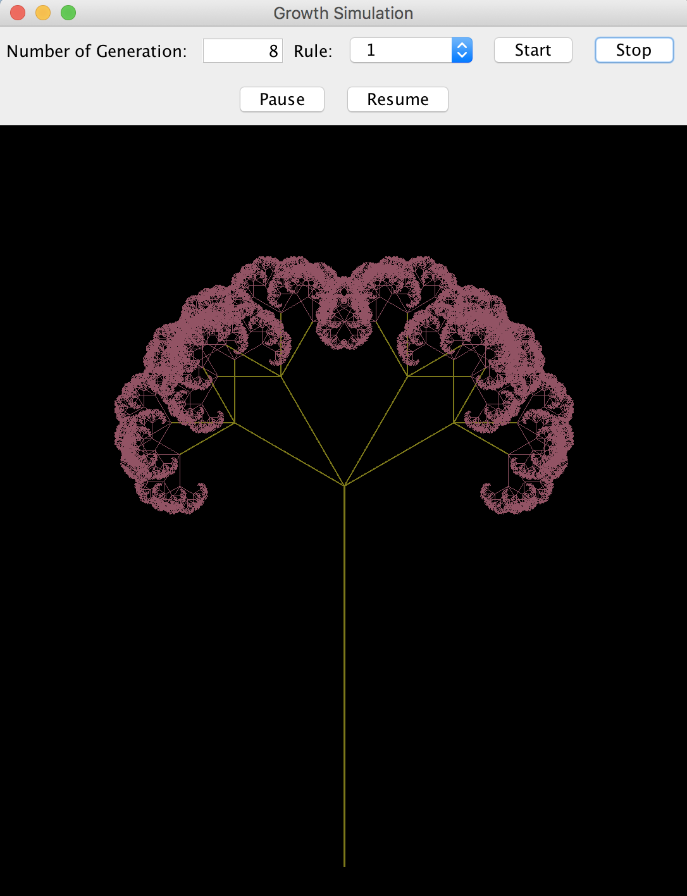
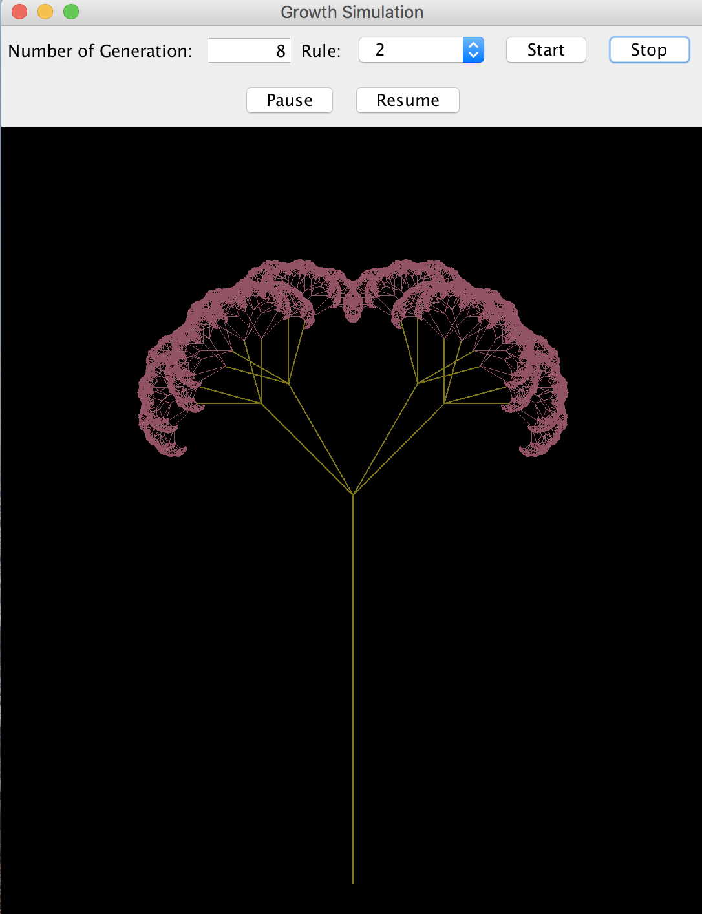
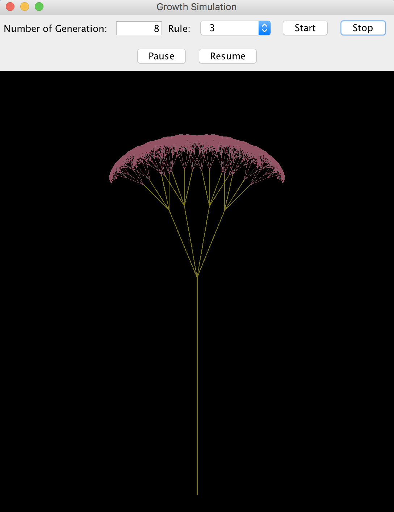
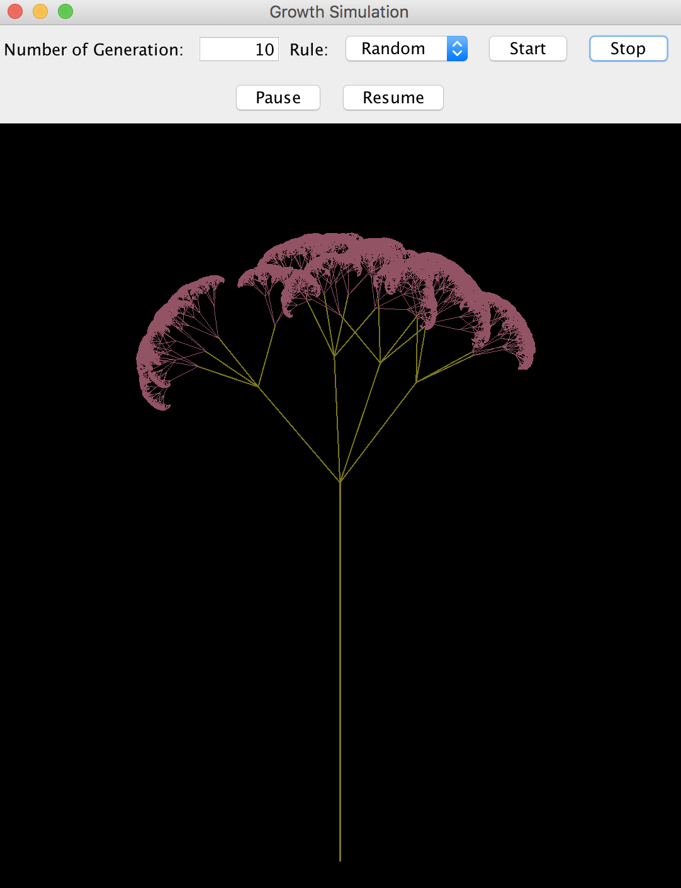

## Hello, this project builds an UI with Java GUI toolkits - Swing & AWT, to simulate the dynamic process of a tree growing. 

### Features include:
1. Different rules to support growing of trees in various shapes
2. Control panel to select a growth mode and control the tree growing

### Sample outputs:
> 
> 
> 
> 
